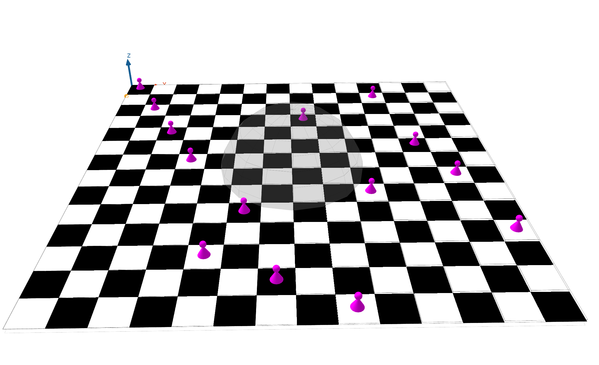
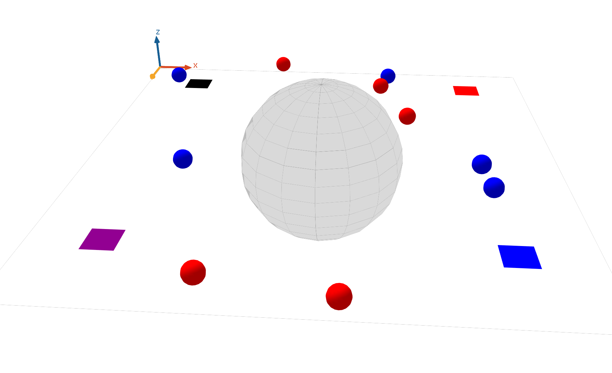

## ID2209 – Distributed Artificial Intelligence and Intelligent Agents
# Assignment 3 – Coordination and Utility

 Group 16 

 Hong Jiang & Yayan Li 

 4th Dec 2023 

The third assignment aims at handing on more experience with agents working together to find a solution to a problem. And agent utility function to control behaviour with more parameters used in FIPA service

## Species
### Task 1 
#### Species Queen

- It can only communication with its predecessor and successor. 
- Have boolean variables which can judge if row and diagonal are both safe (The number of columns corresponds to Queen's number, which is safe for sure).
- If a queen can't find a safe location on its own column, it will ask its predecessor to find a new position.
-  Only when the queen have a safe position can its successor start to find.

### Task 2 
#### Species Stage

- Have a group of numbers represents the quality of different aspects. 
- The number of this group will change.

#### Species Guest

- Have a set of numbers is reserved to weight stage's quality of different aspects.
- After calculation, guest will set the stage with the highest score as target and move to it.

## Implementation

In task 1, we first determined the algorithm for judging safety. Next, determine the logic of communication between queens. Finally, we integrated and tested the program to ensure that the judgment function and communication function worked well together.

In task 2, we create `Stage` and `Guest`  and give them some variables. We observe whether the calculation result is correct through the debug log and check the movement.

## Results

### Task 1 

### Task 2

## Discussion / Conclusion
The N queens problem took a bit longer time than the other task because it exercised our logic ability, but finally we got a deeper understanding of agents. Overall, this assignment made us thinking and coding more, a cool simulation and good assignment.

